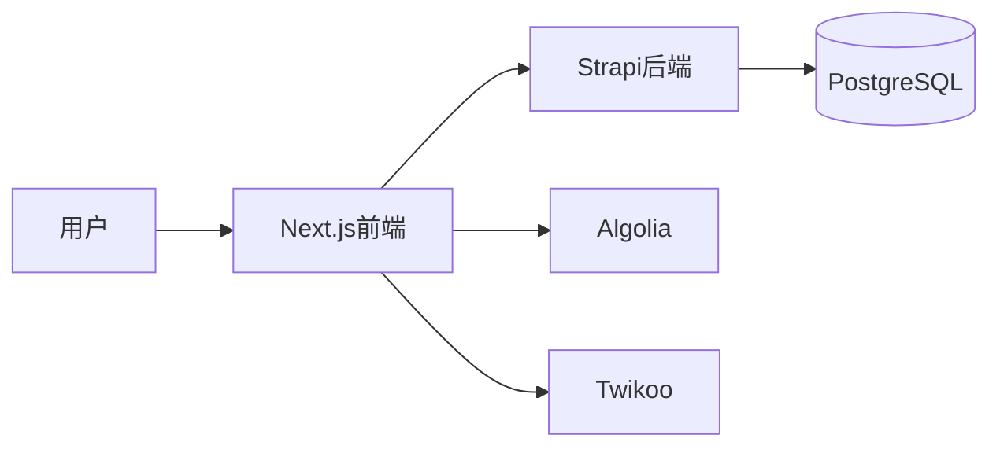

# 🌟 **"Eighteen" 个人博客系统** (Next.js + Strapi v5) ✨

### 🎉 网站已全面开源啦！暂定名：BlogWebsite-Eighteen `(｡•̀ᴗ-)✧ 诶嘿~`

### 👉 原作者网站：[www.wuyilin18.top](https://www.wuyilin18.top/)  
**如果喜欢本项目，欢迎点亮小星星哦~ 🌟🌟🌟 你的Star是作者更新的最大动力！**

---

## ⚠️ 重要提示 ⚠️

### 🚧 新手须知  
本开源项目**不太适合纯小白**，需要：  
- 前端基础（Next.js必备）🧩  
- 后端基础（Strapi次要）🔧  
**强烈建议**提前学习：  
[Next.js中文文档](https://www.nextjs.cn/docs) | [Strapi中文文档](https://www.strapi.cn/dev-docs/intro)  
**别上来就问文章怎么写！！！** 避免踩坑哦~ (；´д｀)ゞ

### 🛠️ 调试日志说明  
**所有 `console.log` 都被注释掉啦~**  
部署前请：  
1. 在VsCode搜索 `console.log`  
2. 删除所有注释符号 `//`  
3. 本地调试OK再部署！  
**(´▽`)ﾉ 温馨提示：前端后端都要检查哟~**

---

## 🎨 效果预览  

  
*✨ 简约而不简单的设计风格~*

---

## 🚀 项目架构  

**现代化全栈博客系统**：  
- **前端**：Next.js (部署于Vercel) 🖥️  
- **后端**：Strapi v5 (部署于云服务器) 📡  
- **搜索**：Algolia 🔍  
- **评论**：Twikoo (部署于Vercel) 💬  



## 📦 环境要求

- Node.js 18.x+ 🟢
- npm 9.x+ 📦
- PostgreSQL 12+ 🐘 (推荐)
- Redis 🧠 (可选缓存)

## 🗂️ 项目结构


```bash
blog-system/
├── frontend/          # Next.js 前端 ✨
├── backend/           # Strapi v5 后端 🚀
└── README.md          # 你现在看的文档 📚
```

------

## 🖥️ 前端配置 (Next.js)


### ⚡ 快速启动

```bash
cd frontend
npm install  # 或 yarn install
npm run dev  # 🚦 开发模式启动！
```


### 🔑 环境变量 (.env.local)

```env
# 🌐 基础配置
# ========================
# 本地开发模式
NEXT_PUBLIC_STRAPI_URL=https://你的strapi后台端口 🚪
NEXT_PUBLIC_STRAPI_API_TOKEN=你的strapi后台token秘钥 🔑

# 🚀 Strapi 后端配置
# ========================
NEXT_PUBLIC_STRAPI_API_URL=http://localhost:1337  # 开发环境 🛠️
# NEXT_PUBLIC_STRAPI_API_URL=https://your-api-domain.com # 生产环境 ☁️
NEXT_PUBLIC_STRAPI_API_TOKEN=your_strapi_api_token_here 🔐

# 🔍 Algolia 搜索配置
# ========================
NEXT_PUBLIC_ALGOLIA_APP_ID=your_algolia_app_id
NEXT_PUBLIC_ALGOLIA_SEARCH_API_KEY=your_algolia_search_api_key
NEXT_PUBLIC_ALGOLIA_INDEX_NAME=blog_posts

# 💬 Twikoo 评论系统
# ========================
NEXT_PUBLIC_TWIKOO_URL=https://twikoo.yourdomain.com
TWIKOO_ENV_ID=your_vercel_environment_id
```


### 📝 配置说明：

1. **基础配置**：本地开发必需的核心参数
2. **Strapi连接**：
   - 开发环境用 `http://localhost:1337`
   - 生产环境注释开发地址，启用生产地址 ☁️
3. **Algolia搜索**：确保索引名称前后端一致 🔍
4. **Twikoo评论**：
   - `NEXT_PUBLIC_TWIKOO_URL` 对应Vercel部署地址
   - `TWIKOO_ENV_ID` 是Vercel环境ID（可在设置中找到）


### ⚠️ 注意事项：

- 所有以 `NEXT_PUBLIC_` 开头的变量会自动暴露给浏览器 🌐
- 敏感密钥（如API Token）不要包含 `NEXT_PUBLIC_` 前缀 🔒
- 修改配置后需要重启开发服务器 ♻️ `(Ctrl+C 然后 npm run dev)`


### ⚙️ 图片配置 (next.config.js 和 next.config.ts)

```js
images: {
  domains: ["localhost", "你的CDN域名"],  // ✏️ 修改这里！
  // ...其他配置
}
```


### 🌐 Vercel 部署

1. 推送代码到 GitHub 🐙
2. 登录 [Vercel](https://vercel.com/) 导入项目
3. 添加环境变量 🔑
4. 点击部署！🚀
   *(≧∇≦)ﾉ 通常3分钟完成部署~*

------

## 🚀 后端配置 (Strapi v5)


### ⚡ 快速启动

```bash
cd backend
npm install
npm run develop  # 🎮 进入管理员模式！
```


### 🔑 环境变量 (.env)

创建 `.env` 文件并配置以下变量：

```env
# ========================
# 🛠️ 核心应用配置
# ========================
HOST=0.0.0.0
PORT=1337
APP_KEYS=你的应用密钥,逗号分隔 🔑
API_TOKEN_SALT=你的API令牌盐值 🧂
ADMIN_JWT_SECRET=管理员JWT密钥 👑
JWT_SECRET=用户JWT密钥 👤

# ========================
# 🌐 公共访问配置 (必填！)
# ========================
PUBLIC_URL=https://你的strapi后台访问端口

# ========================
# 🗄️ 数据库配置
# ========================
DATABASE_CLIENT=postgres  # 推荐生产环境使用 🐘
# DATABASE_CLIENT=sqlite  # 开发环境可用 💻
DATABASE_FILENAME=.tmp/data.db  # SQLite专用
# PostgreSQL配置示例 ↓
# DATABASE_HOST=your-db-host
# DATABASE_PORT=5432
# DATABASE_NAME=strapi
# DATABASE_USERNAME=strapi
# DATABASE_PASSWORD=strongpassword 🔐

# ========================
# 🔍 Algolia 集成配置
# ========================
ALGOLIA_APP_ID=你的Algolia应用ID
ALGOLIA_API_KEY=你的Algolia管理员API密钥 🔑
ALGOLIA_INDEX_NAME=blog_posts  # 需与前端的索引名一致！

# ========================
# ⚙️ 其他配置
# ========================
NODE_ENV=production  # 生产环境设置为production
# SMTP_MAIL=...  # 邮件服务配置（可选）
# REDIS_URL=...  # Redis缓存（可选）
```


### 📝 配置说明：

1. **密钥安全**：

   - `APP_KEYS` 和 `JWT_SECRET` 使用强密码生成器创建 🔐
   - 建议长度：64位十六进制字符（可用 `openssl rand -hex 32` 生成）

2. **数据库选择**：

   - **开发**：SQLite（开箱即用）💻
   - **生产**：PostgreSQL（推荐）🐘

   ```env
   # PostgreSQL生产配置示例
   DATABASE_CLIENT=postgres
   DATABASE_HOST=your-db-host.com
   DATABASE_PORT=5432
   DATABASE_NAME=strapi_prod
   DATABASE_USERNAME=prod_user
   DATABASE_PASSWORD=strong!Password123 🔐
   ```

3. **Algolia注意**：

   - `ALGOLIA_API_KEY` 需要使用 **Admin API Key**（非Search-Only Key）⭐
   - 索引名称需前后端完全一致（包括大小写）🔍

4. **关键配置**：

   - `PUBLIC_URL` 必须设置为最终访问地址（否则图片链接会出错）⚠️
   - `NODE_ENV` 生产环境务必设为 `production`（提升性能+安全）🚀


### ⚠️ 安全警告：

1. **绝不提交**.env文件到版本库！🙅♂️
2. 生产环境禁用SQLite（使用PostgreSQL）🚫
3. 数据库密码包含：大小写字母+数字+特殊字符（长度>12）💪
4. 定期轮换密钥（建议每90天）⏳


### 🔍 Algolia 插件配置

**让文章搜索飞起来~ 🔍✨**  

1. 安装官方插件：  
```bash
npm install strapi-plugin-algolia  # 🚀 安装搜索神器！
```

在 `backend/config/plugins.ts` 中添加：

```ts
export default ({ env }) => ({
    
  // 其他插件配置...
    
  // ========================
  // 🔍 Algolia 搜索插件配置
  // ========================
  "strapi-algolia": {
    enabled: true,
    config: {
      apiKey: env("ALGOLIA_API_KEY"),        // 使用.env中的密钥
      applicationId: env("ALGOLIA_APP_ID"),  // Algolia应用ID
      indexPrefix: process.env.ALGOLIA_INDEX_PREFIX || "strapi", // 索引前缀（可选）
      contentTypes: [
        {
          name: "api::post.post",
          index: "development_blog_posts", // 📌 必须与前端的索引名一致！
          transform: (data) => {
            const baseUrl = process.env.PUBLIC_URL;
            let coverImageUrl = "";
            if (data.CoverImage?.url) {
              coverImageUrl = data.CoverImage.url.startsWith("http")
                ? data.CoverImage.url
                : `${baseUrl}${data.CoverImage.url}`;
            }

            return {
              objectID: data.id.toString(),
              title: data.Title || "",
              slug: data.Slug || "",
              summary: data.Summary || "",
              content: parseRichTextForAlgolia(data.Content), // Use the local parser
              coverImage: coverImageUrl,
              categories: data.categories?.map((cat) => cat.name) || [],
              tags: data.tags?.map((tag) => tag.name) || [],
            };
          },
          populate: {
            Content: true,
            CoverImage: true,
            categories: true,
            tags: true,
          },
        },
      ],
    },
  },
});
```

### ⚠️ 关键注意事项：

1. **索引名称一致性**：
   `index` 值必须与前端的 `NEXT_PUBLIC_ALGOLIA_INDEX_NAME` 完全相同 🔗

   ```ts
   index: "blog_posts"  // ✅ 前后端统一
   ```

2. **调试建议**：
   在Strapi后台观察插件日志 → 确保文章发布时自动同步到Algolia 📤

------


## 💬 Twikoo 评论系统

### 🌐 Vercel 部署

1. 使用 [Twikoo模板](https://github.com/twikoojs/twikoo)
2. 设置环境变量：

```env
MONGODB_URI=mongodb+srv://<账号>:<密码>@集群地址/twikoo
TWIKOO_ADMIN_PASS=你的管理密码 🔑
```


### 🧩 前端集成示例

在评论组件`TwikooComments.tsx`中修改：

```tsx
const finalEnvId = "https://你的Twikoo地址";  // ✏️ 修改这里！
window.twikoo.init({
  envId: finalEnvId,
  el: "#twikoo-comments-container",
  path: pathname
});
```

------


## ☁️ 部署到云服务器

### 🛠️ 准备阶段（Ubuntu 20.04+推荐）

```bash
# 1️⃣ 安装基础依赖
sudo apt update && sudo apt upgrade -y
sudo apt install -y git nginx

# 2️⃣ 安装Node.js（使用nvm）
curl -o- https://raw.githubusercontent.com/nvm-sh/nvm/v0.39.7/install.sh | bash
source ~/.bashrc
nvm install 20  # 🟢 推荐Node.js 20
nvm use 20

# 3️⃣ 安装PostgreSQL
sudo apt install -y postgresql postgresql-contrib
sudo -u postgres psql -c "CREATE DATABASE strapi_prod;"
sudo -u postgres psql -c "CREATE USER strapi_user WITH PASSWORD '强密码';"
sudo -u postgres psql -c "GRANT ALL PRIVILEGES ON DATABASE strapi_prod TO strapi_user;"

# 4️⃣ 防火墙配置
sudo ufw allow 22     # SSH
sudo ufw allow 80     # HTTP
sudo ufw allow 443    # HTTPS
sudo ufw enable       # 🛡️ 激活防火墙
```


### 🚀 启动Strapi服务

```bash
# 1️⃣ 安装PM2进程管理器
npm install -g pm2  # 📦 全局安装

# 2️⃣ 启动项目（在backend目录）
pm2 start npm --name "strapi-prod" -- run start  # 🚀 生产模式启动

# 3️⃣ 保存进程列表
pm2 save

# 4️⃣ 设置开机自启
pm2 startup  # 👑 根据提示执行生成的命令
```


### 🔄 常用PM2命令

```bash
pm2 logs strapi-prod    # 📜 查看实时日志
pm2 restart strapi-prod # 🔁 重启服务
pm2 stop strapi-prod    # ⏹️ 停止服务
```


### 🌐 Nginx反向代理配置

创建 `/etc/nginx/sites-available/strapi`：

```nginx
server {
    listen 80;
    server_name api.yourdomain.com;  # ✏️ 改成你的域名
    
    location / {
        proxy_pass http://localhost:1337;  # 🚪 转发到Strapi
        proxy_http_version 1.1;
        proxy_set_header X-Forwarded-Host $host;
        proxy_set_header X-Forwarded-Server $host;
        proxy_set_header X-Real-IP $remote_addr;
        proxy_set_header X-Forwarded-For $proxy_add_x_forwarded_for;
        proxy_set_header X-Forwarded-Proto $scheme;
        proxy_set_header Host $http_host;
        proxy_set_header Upgrade $http_upgrade;
        proxy_set_header Connection "Upgrade";
        proxy_pass_request_headers on;
    }

    # 静态文件缓存优化（可选）
    location /uploads {
        alias /path/to/backend/public/uploads;
        expires 30d;
        add_header Cache-Control "public";
    }
}
```

激活配置：

```bash
sudo ln -s /etc/nginx/sites-available/strapi /etc/nginx/sites-enabled/
sudo nginx -t  # ✅ 测试配置
sudo systemctl restart nginx  # 🔄 重启Nginx
```


### 📌 部署后检查清单

1. 访问 `http://api.yourdomain.com/admin` 是否能打开后台 👀

2. 检查PM2日志是否有错误 `pm2 logs strapi-prod` 📋

3. 测试Algolia同步：发布新文章 → 查看Algolia控制台 🔍

4. 配置HTTPS（使用Certbot免费证书）🔒

   ```bash
   sudo apt install certbot python3-certbot-nginx
   sudo certbot --nginx -d api.yourdomain.com
   ```

------


## 附录：实用工具函数

### 🧹 HTML标签清理函数

```ts
// 添加到 plugins.ts 文件顶部
const stripHtmlTags = (html: string) => {
  return html
    .replace(/<[^>]*>/g, ' ')   // 移除HTML标签
    .replace(/\s+/g, ' ')       // 合并多个空格
    .trim();                    // 去掉首尾空格
};
```

> **✨ 部署完成！现在你的博客已经准备好服务全世界啦~ 🌍**
> **遇到问题？记得查看日志 `pm2 logs` 哦 (๑•̀ㅂ•́)و✧**


## 🌟 内容更新流程  

### ✍️ 添加新博客文章  
**超简单四步发布法~** (๑˃ᴗ˂)ﻭ  
1. **登录** Strapi管理后台 👉 `https://你的域名/admin`  
2. 进入 **Content Manager** → **Posts** 📚  
3. 点击 **+ Create new entry** 开始创作 ✨  
4. 编辑完成后 → **Save** → **Publish** 🚀  
5. **自动同步**：新文章将实时同步到Algolia搜索库 🔄  

> 💡 小技巧：  
> - 使用Markdown语法写作更高效 📝  
> - 添加分类/标签提升可发现性 🏷️  
> - 设置特色图片吸引读者 👀  

---


### ⚙️ 更新网站配置  

**前端/后端分开管理** 🔧  

#### 🖥️ 前端更新流程  
1. 修改前端代码（主题/样式/功能）💅  
2. 推送更新到GitHub仓库 🐙  
3. **Vercel自动触发**：  
   - 重构建Next.js应用 ♻️  
   - 全球CDN即时更新 🌍  

#### 📡 后端更新缓存  
**当修改Strapi内容时**：  
- 文章封面更新 🖼️  
- 分类结构调整 🧩  
- 全局配置变更 ⚙️  

**需清除前端缓存**：  

```diff
# 方法一：手动触发重部署
+ 进入Vercel控制台 → 点击『Redeploy』按钮 🔁

# 方法二：启用ISR（推荐✨）
+ 在Next.js页面添加revalidate参数：
  export const revalidate = 60  // 每60秒刷新缓存 ⏱️
```


### 🚀 高级更新技巧  

#### 增量静态再生 (ISR) 配置示例  
```tsx
// 📂 路径: frontend/pages/posts/[slug].tsx
export async function getStaticProps({ params }) {
  const post = await getPostBySlug(params.slug);
  
  return {
    props: { post },
    revalidate: 120,  // ⏰ 每2分钟自动刷新页面
  };
}
```
**效果**：  
- 用户访问时自动检查更新 🔍  
- 内容变更后2分钟内全球生效 🌐  
- 大幅降低API请求压力 📉  

#### 手动清除缓存API  
```ts
// 在Strapi后端添加清除缓存端点
router.post('/purge-cache', async (ctx) => {
  await fetch('https://api.vercel.com/.../cache', {
    method: 'DELETE',
    headers: { Authorization: `Bearer ${process.env.VERCEL_TOKEN}` }
  });
  ctx.send({ success: true });
});
```
**使用场景**：  
- 紧急内容修复 🚑  
- 大规模数据迁移 🚚  
- 主题重大更新 🎨  

> **✨ 小贴士**：  
> 日常更新使用ISR足够高效，  
> 重大变更时配合手动清除更稳妥！  
> `( •̀ ω •́ )✧ 保持博客始终新鲜~`

------


## 🔒 安全指南

### 🔑 密钥管理最佳实践

- 使用 `密码生成器` 创建强密钥 (建议32位+) 🔐
- 开发/生产环境使用 **不同密钥** 🔄
- 定期轮换密钥 ⏳
- 永远不要提交 `.env` 文件！ 🙅♂️

### 🛡️ 加固措施

- 禁用Strapi公共注册 🚫
- 数据库启用SSL连接 🔒
- 配置云服务器防火墙 🔥
- 备份！备份！备份！ 💾 (重要的事情说三遍)

------


## 🧰 故障排除

| 问题现象         | 解决方案                              |
| :--------------- | :------------------------------------ |
| 🔍 Algolia无结果  | 检查Strapi插件日志 → 确认内容发布状态 |
| 💬 评论加载失败   | 验证MongoDB连接 → 检查Twikoo服务状态  |
| 🚨 Strapi无法访问 | `pm2 logs strapi` → 检查防火墙规则    |
| 🖼️ 图片不显示     | 检查CDN配置 → 确认next.config.js域名  |

------


## ❤️ 支持与贡献

遇到问题？欢迎提交Issue：
[GitHub Issues](https://github.com/wuyilin18/BlogWebsite-SiliconNebula/issues)
*(ง •_•)ง 作者会尽快回复！*


## 📜 许可证

MIT License - 自由使用与修改！ 🆓

------

**✨ Happy Coding! 祝你的博客闪闪发光~ ✨**
**—— 来自十八的技术小窝 (｡♥‿♥｡) ——**